# Web Interface Structure

```mermaid
graph TD
    A[Email Validation System] --> B[Web Server]
    B --> C[Public Interface]
    B --> D[Admin Dashboard]
    
    C --> C1[Single Email Tab]
    C --> C2[Bulk Validation Tab]
    C --> C3[Job Tracking Tab]
    
    C1 --> C1A[Email Input]
    C1 --> C1B[Options Checkbox]
    C1 --> C1C[Validate Button]
    C1 --> C1D[Results Display]
    
    C2 --> C2A[Emails Textarea]
    C2 --> C2B[Options Checkbox]
    C2 --> C2C[Validate Button]
    C2 --> C2D[Job Creation Result]
    
    C3 --> C3A[Job ID Input]
    C3 --> C3B[Status Button]
    C3 --> C3C[Results Button]
    C3 --> C3D[Job Information]
    
    D --> D1[Dashboard Header]
    D --> D2[Statistics Cards]
    D --> D3[Jobs Table]
    D --> D4[Refresh Controls]
    
    D1 --> D1A[Title]
    D1 --> D1B[Refresh Button]
    
    D2 --> D2A[Total Jobs Card]
    D2 --> D2B[Active Jobs Card]
    D2 --> D2C[Completed Jobs Card]
    D2 --> D2D[Failed Jobs Card]
    
    D3 --> D3A[Table Header]
    D3 --> D3B[Job Rows]
    
    style A fill:#e1f5fe
    style B fill:#f3e5f5
    style C fill:#e8f5e8
    style D fill:#fff3e0
    style C1 fill:#c8e6c9
    style C2 fill:#c8e6c9
    style C3 fill:#c8e6c9
    style D1 fill:#ffe0b2
    style D2 fill:#ffe0b2
    style D3 fill:#ffe0b2
```

## Component Relationships

### Public Interface Components
- **Tabs**: Provide navigation between different validation modes
- **Form Elements**: Collect user input for validation requests
- **Action Buttons**: Trigger validation processes
- **Result Displays**: Show validation outcomes with visual indicators

### Admin Dashboard Components
- **Header**: Contains dashboard title and refresh controls
- **Statistics Cards**: Display key metrics in an easily digestible format
- **Jobs Table**: Provide detailed view of recent validation jobs
- **Refresh System**: Keep dashboard data up-to-date

### Data Flow

1. **User Input** → Form Elements collect email addresses and options
2. **API Requests** → JavaScript sends validation requests to backend
3. **Processing** → Server processes validation requests
4. **Response** → Results returned to frontend
5. **Display** → Results rendered in appropriate UI components
6. **Monitoring** → Admin dashboard polls for system statistics

### Styling System

- **Color Palette**: 
  - Primary: Blue (#667eea) for actions and highlights
  - Success: Green (#4caf50) for valid emails
  - Warning: Orange (#ff9800) for risky emails
  - Error: Red (#f44336) for invalid emails
  - Neutral: Gray (#9e9e9e) for unknown status

- **Component Hierarchy**:
  - Containers provide structure and spacing
  - Cards organize related information
  - Badges offer status at a glance
  - Tables present data in structured format

- **Responsive Behavior**:
  - Grid layouts adapt to screen size
  - Stacked elements on mobile
  - Flexible spacing and sizing
  - Touch-friendly controls