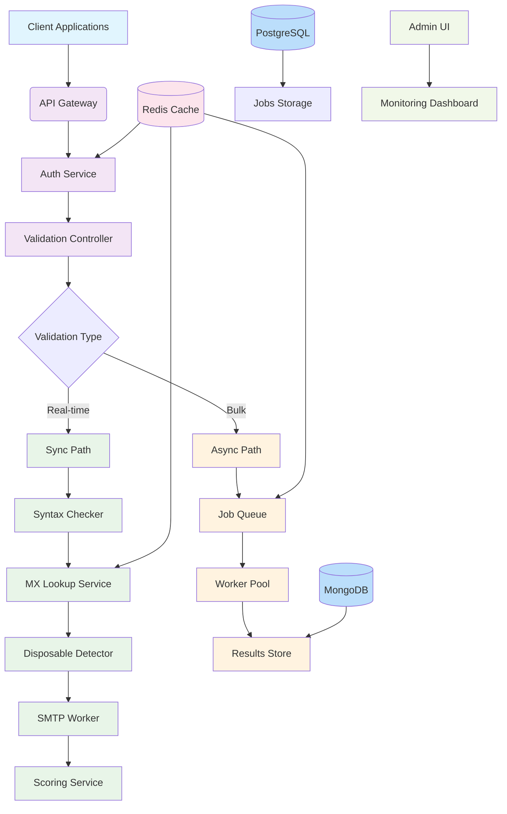

# Email Validation System Architecture

## Component Descriptions

### API Layer
- **API Gateway**: Entry point for all client requests, handles SSL termination and basic routing
- **Auth Service**: Validates API keys, enforces rate limits and quota management
- **Validation Controller**: Routes requests to appropriate processing path (sync/async)

### Processing Paths
- **Sync Path**: For real-time validation requests, processes immediately and returns results
- **Async Path**: For bulk validation requests, queues jobs for background processing

### Core Services
- **Syntax Checker**: Validates email format using regex and RFC heuristics
- **MX Lookup Service**: Resolves domain MX records using DNS queries
- **Disposable Detector**: Identifies disposable email addresses using domain blocklists
- **SMTP Worker**: Connects to mail servers to verify email deliverability
- **Scoring Service**: Calculates quality scores based on all validation factors

### Infrastructure
- **Job Queue**: Message queue for distributing bulk validation jobs to workers
- **Worker Pool**: Horizontally scalable pool of workers for processing validation jobs
- **Redis Cache**: In-memory cache for MX records, validation results, and rate limiting
- **PostgreSQL**: Relational database for job tracking and API key management
- **MongoDB**: Document database for storing detailed validation results
- **Admin UI**: Administrative interface for monitoring system health and job status

## Data Flow

### Real-time Validation
1. Client sends validation request to API Gateway
2. Auth Service validates API key and checks rate limits
3. Validation Controller routes to Sync Path
4. Email passes through series of validation checks:
   - Syntax validation
   - MX record lookup (cached when possible)
   - Disposable email detection
   - SMTP verification (when enabled)
   - Role account detection
5. Scoring Service calculates final quality score
6. Results returned to client

### Bulk Validation
1. Client uploads batch of emails to API Gateway
2. Auth Service validates API key and checks quota
3. Validation Controller creates job and routes to Async Path
4. Job is chunked into smaller batches and queued
5. Worker Pool processes jobs from queue:
   - Same validation pipeline as real-time but with different timeouts
   - Results stored in database
6. Client polls job status endpoint for progress
7. Client retrieves results when job completes

## Scalability Patterns

- **Horizontal Scaling**: Worker pool can be scaled based on queue depth
- **Caching**: MX records and validation results cached to reduce external lookups
- **Rate Limiting**: Token bucket algorithm in Redis to enforce API quotas
- **Load Balancing**: Multiple API instances behind load balancer
- **Database Sharding**: Results database can be sharded by date or customer